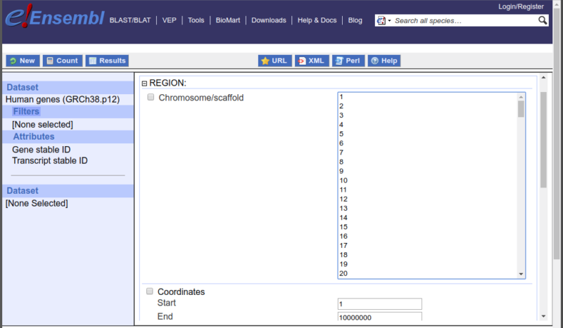

```{r setup, echo = FALSE}
knitr::opts_chunk$set(error = TRUE, cache = FALSE, eval = TRUE)
httr::set_config(httr::config(ssl_verifypeer = FALSE))
```

# Introduction

Accessing the data available in Ensembl is by far most frequent use of the `r Biocpkg("biomaRt")` package.  With that in mind `r Biocpkg("biomaRt")` provides a number of functions that are tailored to work specifically with the BioMart instances provided by Ensembl.  This vignette details this Ensembl specific functionality and provides a number of example usecases that can be used as the basis for specifying your own queries.

# Selecting an Ensembl BioMart database and dataset

Every analysis with `r Biocpkg("biomaRt")` starts with selecting a BioMart database to use.  

```{r annotate,echo=FALSE}
options(width=100)
```

```{r useEnsembl}
library(biomaRt)
ensembl <- useEnsembl(biomart = "genes", dataset = "hsapiens_gene_ensembl")
```

If this your first time using `r Biocpkg("biomaRt")` , you might wonder how to find the two arguments we supplied to the `useEnsembl()` command.  This is a two step process, but once you know the setting you need you can use the version shown above as a single command.  These initial steps are outlined below.

## Identifying the database you need

The first step is to find the names of the BioMart services Ensembl is currently providing.  We can do this using the function `listEnsembl()`, which will display all available Ensembl BioMart web services.  The first column gives us the name we should provide to the `biomart` argument in `useEnsembl()`, and the second gives a more comprehensive title for the dataset along with the Ensembl version.

```{r, listEnsembl}
listEnsembl()
```

The `useEnsembl()` function can now be used to connect to the desired BioMart database.  The `biomart` argument should be given a valid name from the output of `listEnsembl()`. In the next example we will select the main Ensembl mart, which provides access to gene annotation information.

```{r ensembl1}
ensembl <- useEnsembl(biomart = "genes")
```

If we print the current `ensembl` object, we can see that the `r ensembl@biomart` database ^[this is how Ensembl name the database on their server] has been selected, but that no dataset has been chosen.

```{r ensembl2}
ensembl
```

## Choosing a dataset

BioMart databases can contain several datasets. For example, within the Ensembl genes mart every species is a different dataset.  In the next step we look at which datasets are available in the selected BioMart by using the function `listDatasets()`. *Note: here we use the function `head()` to display only the first 5 entries as the complete list has `r nrow(listDatasets(ensembl))` entries.*

```{r listDatasets}
datasets <- listDatasets(ensembl)
head(datasets)
```

The `listDatasets()` function will return every available option, however this can be unwieldy when the list of results is long, involving much scrolling to find the entry you are interested in.  `r Biocpkg("biomaRt")` also provides the functions `searchDatasets()` which will try to find any entries matching a specific term or pattern.  For example, if we want to find the details of any datasets in our `ensembl` mart that contain the term '*hsapiens*' we could do the following:

```{r searchDatasets, echo = TRUE, eval = TRUE}
searchDatasets(mart = ensembl, pattern = "hsapiens")
```

To use a dataset we can update our `Mart` object using the function `useDataset()`.  In the example below we choose to use the *hsapiens* dataset.

```{r ensembl3, eval=TRUE}
ensembl <- useDataset(dataset = "hsapiens_gene_ensembl", mart = ensembl)
```

As mentioned previously, if the dataset one wants to use is known in advance i.e. you've gone through this process before, we can select a both the database and dataset in one step:

```{r ensembl4}
ensembl <- useEnsembl(biomart = "genes", dataset = "hsapiens_gene_ensembl")
```

## Ensembl mirror sites

To improve performance Ensembl provides several mirrors of their site distributed around the globe.  When you use the default settings for `useEnsembl()` your queries will be directed to your closest mirror geographically.  In theory this should give you the best performance, however this is not always the case in practice.  For example the if the nearest mirror is experiencing many queries from other users it may perform poorly for you.  You can use the `mirror` argument to `useEnsembl()` to explicitly request a specific mirror.

```{r, mirrors}
ensembl <- useEnsembl(biomart = "ensembl", 
                   dataset = "hsapiens_gene_ensembl", 
                   mirror = "useast")
```

Values for the mirror argument are: `useast`, `uswest`, `asia`, and `www`.

## Using Ensembl Genomes

Ensembl Genomes expands the effort to provide annotation from the vertebrate genomes provided by the main Ensembl project across taxonomic space, with separate BioMart interfaces for Protists, Plants, Metazoa and Fungi.

*Note: Unfortunately there is no BioMart interface to the Ensembl Bacteria data.  The number of bacterial genomes is in the tens of thousands and BioMart does not perform well when providing data on that scale.*

You can use the functions `listEnsemblGenomes()` and `useEnsemblGenomes()` in similar fashion to the functions shown previously.  For example first we can list the available Ensembl Genomes marts:

```{r listEnsemblGenomes}
listEnsemblGenomes()
```

We can the select the Ensembl Plants database, and search for the dataset name for Arabidopsis.

```{r, plants1}
ensembl_plants <- useEnsemblGenomes(biomart = "plants_mart")
searchDatasets(ensembl_plants, pattern = "Arabidopsis")
```

We can then use this information to create our `Mart` object that will access the correct database and dataset.

```{r}
ensembl_arabidopsis <- useEnsemblGenomes(biomart = "plants_mart", 
                                         dataset = "athaliana_eg_gene")
```

# How to build a biomaRt query

The `getBM()` function has three arguments that need to be introduced: filters, attributes and values.
*Filters* define a restriction on the query.  For example you want to restrict the output to all genes located on the human X chromosome then the filter *chromosome_name* can be used with value 'X'. The `listFilters()` function shows you all available filters in the selected dataset.

```{r filters}
filters = listFilters(ensembl)
filters[1:5,]
``` 

*Attributes* define the values we are interested in to retrieve.  For example we want to retrieve the gene symbols or chromosomal coordinates.  The `listAttributes()` function displays all available attributes in the selected dataset.

```{r attributes}
attributes = listAttributes(ensembl)
attributes[1:5,]
```

The `getBM()` function is the main query function in `r Biocpkg("biomaRt")`.  It has four main arguments:

* `attributes`:  is a vector of attributes that one wants to retrieve (= the output of the query).
* `filters`:  is a vector of filters that one wil use as input to the query.
* `values`: a vector of values for the filters.  In case multple filters are in use, the values argument requires a list of values where each position in the list corresponds to the position of the filters in the filters argument (see examples below).
* `mart`: is an object of class `Mart`, which is created by the `useMart()` function.

*Note: for some frequently used queries to Ensembl, wrapper functions are available: `getGene()` and `getSequence()`.  These functions call the `getBM()` function with hard coded filter and attribute names.*

Now that we selected a BioMart database and dataset, and know about attributes, filters, and the values for filters; we can build a `r Biocpkg("biomaRt")` query.  Let's make an easy query for the following problem:  We have a list of Affymetrix identifiers from the u133plus2 platform and we want to retrieve the corresponding EntrezGene identifiers using the Ensembl mappings.

The u133plus2 platform will be the filter for this query and as values for this filter we use our list of Affymetrix identifiers.  As output (attributes) for the query we want to retrieve the EntrezGene and u133plus2 identifiers so we get a mapping of these two identifiers as a result.  The exact names that we will have to use to specify the attributes and filters can be retrieved with the `listAttributes()` and `listFilters()` function respectively.  Let's now run the query:


```{r getBM1, echo=TRUE, eval=TRUE}
affyids <- c("202763_at","209310_s_at","207500_at")
getBM(attributes = c('affy_hg_u133_plus_2', 'entrezgene_id'),
      filters = 'affy_hg_u133_plus_2',
      values = affyids, 
      mart = ensembl)
```  

## Searching for filters and attributes

The functions `listAttributes()` and `listFilters()` will return every available option for their respective types, which can produce a very long output where it is hard to find the value you are interested in.  `r Biocpkg("biomaRt")` also provides the functions `searchAttributes()` and `searchFilters()` which will try to find any entries matching a specific term or pattern, in a similar fashion to `searchDatasets()` seen previously.  You can use these functions to find available attributes and filters that you may be interested in.  The example below returns the details for all attributes that contain the pattern '*hgnc*'.

```{r searchAttributes, echo = TRUE, eval = TRUE}
searchAttributes(mart = ensembl, pattern = "hgnc")
```

For advanced use, note that the *pattern* argument takes a regular expression.  This means you can create more complex queries if required.  Imagine, for example, that we have the string *ENST00000577249.1*, which we know is an Ensembl ID of some kind, but we aren't sure what the appropriate filter term is.  The example shown next uses a pattern that will find all filters that contain the terms '*ensembl*' and '*id*'.  This allows us to reduced the list of filters to only those that might be appropriate for our example.

```{r searchFilters, echo = TRUE, eval = TRUE}
searchFilters(mart = ensembl, pattern = "ensembl.*id")
```

From this we can compare *ENST00000577249.1* with the examples given in the description column, and see it is a Transcript ID with version.  Thus the appropriate filter value to use with it is `ensembl_transcript_id_version`.

## Using predefined filter values

Many filters have a predefined list of values that are known to be in the dataset they are associated with.  An common example would be the names of chromosomes when searching a dataset at Ensembl.  In this online interface to BioMart these available options are displayed as a list as shown in Figure \@ref(fig:filtervalues).

```{r filtervalues, fig.cap='The options available to the Chromosome/Scaffold field are limited to a pretermined list based on the values in this dataset.', echo = FALSE}

```

You can list this in an R session with the function `listFilterValues()`, passing it a mart object and the name of the filter.  For example, to list the possible chromosome names you could run the following:

```{r chromosomeNames, results = FALSE}
listFilterValues(mart = ensembl, filter = "chromosome_name")
```

It is also possible to search the list of available values via `searchFilterValues()`.  In the two examples below, the first returns all chromosome names starting with "*GL*", while the second will find any phenotype descriptions that contain the string "*Crohn*".

```{r searchFilterValues, results = FALSE}
searchFilterValues(mart = ensembl, filter = "chromosome_name", pattern = "^GL")
searchFilterValues(mart = ensembl, filter = "phenotype_description", pattern = "Crohn")
```

# Using archived versions of Ensembl

It is possible to query archived versions of Ensembl through `r Biocpkg("biomaRt")`, so you can maintain consistent annotation throughout the duration of a project.

`r Biocpkg("biomaRt")` provides the function `listEnsemblArchives()` to view the available Ensembl archives.  This function takes no arguments, and produces a table containing the name and version number of the available archives, the date they were first released, and the URL where they can be accessed.

```{r archiveMarts, echo = TRUE, eval = TRUE}
listEnsemblArchives()
```

Alternatively, one can use the <http://www.ensembl.org> website to find an archived version.  From the main page scroll down the bottom of the page, click on 'view in Archive' and select the archive you need.  

*You will notice that there is an archive URL even for the current release of Ensembl.  It can be useful to use this if you wish to ensure that script you write now will return exactly the same results in the future.  Using `www.ensembl.org` will always access the current release, and so the data retrieved may change over time as new releases come out.*

Whichever method you use to find the URL of the archive you wish to query, copy the url and use that in the `host` argument as shown below to connect to the specified BioMart database.  The example below shows how to query Ensembl 54. 


```{r archiveMarts3, echo = TRUE, eval = TRUE}
listEnsembl(version = 54)
ensembl54 <- useEnsembl(biomart = 'genes', 
                       dataset = 'hsapiens_gene_ensembl',
                       version = 54)
```


# Result Caching

To save time and computing resources `r Biocpkg("biomaRt")` will attempt to identify when you are re-running a query you have executed before.  Each time a new query is run, the results will be saved to a cache on your computer. If a query is identified as having been run previously, rather than submitting the query to the server, the results will be loaded from the cache.

You can get some information on the size and location of the cache using the function `biomartCacheInfo()`:

```{r cacheInfo}
biomartCacheInfo()
```

The cache can be deleted using the command `biomartCacheClear()`.  This will remove all cached files.


# biomaRt helper functions

This section describes a set of `r Biocpkg("biomaRt")` helper functions that can be used to export FASTA format sequences, retrieve values for certain filters and exploring the available filters and attributes in a more systematic manner. 

## exportFASTA

The data.frames obtained by the getSequence function can be exported to FASTA files using the `exportFASTA()` function.  One has to specify the data.frame to export and the filename using the file argument.

## Finding out more information on filters

### filterType

Boolean filters need a value TRUE or FALSE in `r Biocpkg("biomaRt")`.  Setting the value TRUE will include all information that fulfill the filter requirement.  Setting FALSE will exclude the information that fulfills the filter requirement and will return all values that don't fulfill the filter.
For most of the filters, their name indicates if the type is a boolean or not and they will usually start with "with".  However this is not a rule and to make sure you got the type right you can use the function `filterType()` to investigate the type of the filter you want to use.

```{r filterType}
filterType("with_affy_hg_u133_plus_2",ensembl)
```

### filterOptions

Some filters have a limited set of values that can be given to them.  To know which values these are one can use the `filterOptions()` function to retrieve the predetermed values of the respective filter.


```{r filterOptions}
filterOptions("biotype", ensembl)
```

If there are no predetermed values e.g. for the entrezgene filter, then `filterOptions()` will return the type of filter it is. And most of the times the filter name or it's description will suggest what values one case use for the respective filter (e.g. entrezgene filter will work with enterzgene identifiers as values)

## Attribute Pages

For large BioMart databases such as Ensembl, the number of attributes displayed by the `listAttributes()` function can be very large. 
In BioMart databases, attributes are put together in pages, such as sequences, features, homologs for Ensembl.
An overview of the attributes pages present in the respective BioMart dataset can be obtained with the `attributePages()` function.


```{r attributePages}
pages = attributePages(ensembl)
pages
```

To show us a smaller list of attributes which belong to a specific page, we can now specify this in the `listAttributes()` function.  *The set of attributes is still quite long, so we use `head()` to show only the first few items here.*

```{r listAttributes}
head(listAttributes(ensembl, page="feature_page"))
```

We now get a short list of attributes related to the region where the genes are located.


# Using `select()`
In order to provide a more consistent interface to all annotations in
Bioconductor the `select()`, `columns()`,
`keytypes()` and `keys()` have been implemented to wrap
some of the existing functionality above.  These methods can be called
in the same manner that they are used in other parts of the project
except that instead of taking a `AnnotationDb` derived class
they take instead a `Mart` derived class as their 1st argument.
Otherwise usage should be essentially the same.  You still use
`columns()` to discover things that can be extracted from a
`Mart`, and `keytypes()` to discover which things can be
used as keys with `select()`.  

```{r columnsAndKeyTypes}
mart <- useMart(dataset="hsapiens_gene_ensembl",biomart='ensembl')
head(keytypes(mart), n=3)
head(columns(mart), n=3)
``` 

And you still can use `keys()` to extract potential keys, for a
particular key type.  

```{r keys1}
k = keys(mart, keytype="chromosome_name")
head(k, n=3)
``` 

When using `keys()`, you can even take advantage of the extra
arguments that are available for others keys methods.

```{r keys2}
k = keys(mart, keytype="chromosome_name", pattern="LRG")
head(k, n=3)
``` 

Unfortunately the `keys()` method will not work with all key
types because they are not all supported.

But you can still use `select()` here to extract columns of data
that match a particular set of keys (this is basically a wrapper for
`getBM()`).

```{r select}
affy=c("202763_at","209310_s_at","207500_at")
select(mart, keys=affy, columns=c('affy_hg_u133_plus_2','entrezgene_id'),
  keytype='affy_hg_u133_plus_2')
``` 

So why would we want to do this when we already have functions like `getBM()`?  For two reasons: 1) for people who are familiar
with select and it's helper methods, they can now proceed to use `r Biocpkg("biomaRt")` making the same kinds of calls that are already familiar to
them and 2) because the select method is implemented in many places elsewhere, the fact that these methods are shared allows for more
convenient programmatic access of all these resources.  An example of a package that takes advantage of this is the `r Biocpkg("OrganismDbi")` package. Where several packages can be accessed as if they were one resource.

# Examples of biomaRt queries

In the sections below a variety of example queries are described.  Every example is written as a task, and we have to come up with a `r Biocpkg("biomaRt")` solution to the problem.

##  Annotate a set of Affymetrix identifiers with HUGO symbol and chromosomal locations of corresponding genes

We have a list of Affymetrix hgu133plus2 identifiers and we would like to retrieve the HUGO gene symbols, chromosome names, start and end positions and the bands of the corresponding genes.  The `listAttributes()` and the `listFilters()` functions give us an overview of the available attributes and filters and we look in those lists to find the corresponding attribute and filter names we need.  For this query we'll need the following attributes: hgnc_symbol, chromsome_name, start_position, end_position, band and affy_hg_u133_plus_2 (as we want these in the output to provide a mapping with our original Affymetrix input identifiers.  There is one filter in this query which is the affy_hg_u133_plus_2 filter as we use a list of Affymetrix identifiers as input.  Putting this all together in the `getBM()` and performing the query gives: 

```{r task1, echo=TRUE,eval=TRUE}
affyids=c("202763_at","209310_s_at","207500_at")
getBM(attributes = c('affy_hg_u133_plus_2', 'hgnc_symbol', 'chromosome_name',
                   'start_position', 'end_position', 'band'),
      filters = 'affy_hg_u133_plus_2', 
      values = affyids, 
      mart = ensembl)
``` 


## Annotate a set of EntrezGene identifiers with GO annotation

In this task we start out with a list of EntrezGene identiers and we want to retrieve GO identifiers related to biological processes that are associated with these entrezgene identifiers.  Again we look at the output of `listAttributes()` and `listFilters()`  to find the filter and attributes we need.  Then we construct the following query:


```{r task2, echo=TRUE,eval=TRUE}
entrez=c("673","837")
goids = getBM(attributes = c('entrezgene_id', 'go_id'), 
              filters = 'entrezgene_id', 
              values = entrez, 
              mart = ensembl)
head(goids)
```

## Retrieve all HUGO gene symbols of genes that are located on chromosomes 17,20 or Y, and are associated with specific GO terms 

The GO terms we are interested in are: **GO:0051330**, **GO:0000080**, **GO:0000114**, **GO:0000082**.  The key to performing this query is to understand that the `getBM()` function enables you to use more than one filter at the same time.  In order to do this, the filter argument should be a vector with the filter names.  The values should be a list, where the first element of the list corresponds to the first filter and the second list element to the second filter and so on.  The elements of this list are vectors containing the possible values for the corresponding filters.

```{r task3, echo=TRUE,eval=TRUE}
 go=c("GO:0051330","GO:0000080","GO:0000114","GO:0000082")
 chrom=c(17,20,"Y")
 getBM(attributes= "hgnc_symbol",
        filters=c("go","chromosome_name"),
        values=list(go, chrom), mart=ensembl)
```


##  Annotate set of idenfiers with INTERPRO protein domain identifiers

In this example we want to annotate the following two RefSeq identifiers: **NM_005359** and **NM_000546** with INTERPRO protein domain identifiers and a description of the protein domains.

```{r task4, echo=TRUE,eval=TRUE}
refseqids = c("NM_005359","NM_000546")
ipro = getBM(attributes=c("refseq_mrna","interpro","interpro_description"), 
             filters="refseq_mrna",
             values=refseqids, 
             mart=ensembl)
ipro
```

## Select all Affymetrix identifiers on the hgu133plus2 chip and Ensembl gene identifiers for genes located on chromosome 16 between basepair 1100000 and 1250000.

In this example we will again use multiple filters: *chromosome_name*, *start*, and *end* as we filter on these three conditions. Note that when a chromosome name, a start position and an end position are jointly used as filters, the BioMart webservice interprets this as return everything from the given chromosome between the given start and end positions.

```{r task5, eval = TRUE}
getBM(attributes = c('affy_hg_u133_plus_2','ensembl_gene_id'), 
      filters = c('chromosome_name','start','end'),
      values = list(16,1100000,1250000), 
      mart = ensembl)
```

 
## Retrieve all EntrezGene identifiers and HUGO gene symbols of genes which have a "MAP kinase activity" GO term associated with it.
The GO identifier for MAP kinase activity is **GO:0004707**.  In our query we will use *go_id* as our filter, and *entrezgene_id* and *hgnc_symbol* as attributes.  Here's the query:

```{r task6, echo=TRUE, eval = TRUE}
getBM(attributes = c('entrezgene_id','hgnc_symbol'), 
      filters = 'go', 
      values = 'GO:0004707', 
      mart = ensembl)
```


##  Given a set of EntrezGene identifiers, retrieve 100bp upstream promoter sequences
 
All sequence related queries to Ensembl are available through the `getSequence()` wrapper function. `getBM()` can also be used directly to retrieve sequences but this can get complicated so using getSequence is recommended.

Sequences can be retrieved using the `getSequence()` function either starting from chromosomal coordinates or identifiers.  
The chromosome name can be specified using the *chromosome* argument.  The *start* and *end* arguments are used to specify *start* and *end* positions on the chromosome. 
The type of sequence returned can be specified by the *seqType* argument which takes the following values:

* *cdna*
* *peptide* for protein sequences
* *3utr* for 3' UTR sequences 
* *5utr* for 5' UTR sequences 
* *gene_exon* for exon sequences only
* *transcript_exon* for transcript specific exonic sequences only
* *transcript_exon_intron* gives the full unspliced transcript, that is exons + introns
* *gene_exon_intron* gives the exons + introns of a gene
* *coding* gives the coding sequence only
* *coding_transcript_flank* gives the flanking region of the transcript including the UTRs, this must be accompanied with a given value for the upstream or downstream attribute
* *coding_gene_flank* gives the flanking region of the gene including the UTRs, this must be accompanied with a given value for the upstream or downstream attribute
* *transcript_flank* gives the flanking region of the transcript exculding the UTRs, this must be accompanied with a given value for the upstream or downstream attribute
* *gene_flank* gives the flanking region of the gene excluding the UTRs, this must be accompanied with a given value for the upstream or downstream attribute

In MySQL mode the `getSequence()` function is more limited and the sequence that is returned is the 5' to 3'+ strand of the genomic sequence, given a chromosome, as start and an end position.

This task requires us to retrieve 100bp upstream promoter sequences from a set of EntrezGene identifiers.  The *type* argument in `getSequence()` can be thought of as the filter in this query and uses the same input names given by `listFilters()`. In our query we use `entrezgene_id` for the type argument.  Next we have to specify which type of sequences we want to retrieve, here we are interested in the sequences of the promoter region, starting right next to the coding start of the gene.  Setting the *seqType* to `coding_gene_flank` will give us what we need.  The *upstream* argument is used to specify how many bp of upstream sequence we want to retrieve, here we'll retrieve a rather short sequence of 100bp.  Putting this all together in `getSequence()` gives:


```{r task7, eval=TRUE}
entrez=c("673","7157","837")
getSequence(id = entrez, 
            type="entrezgene_id",
            seqType="coding_gene_flank",
            upstream=100, 
            mart=ensembl) 
``` 


## Retrieve all 5' UTR sequences of all genes that are located on chromosome 3 between the positions 185,514,033 and 185,535,839

As described in the provious task getSequence can also use chromosomal coordinates to retrieve sequences of all genes that lie in the given region. We also have to specify which type of identifier we want to retrieve together with the sequences, here we choose for entrezgene identifiers.

```{r task8, echo=TRUE,eval=TRUE}
utr5 = getSequence(chromosome=3, start=185514033, end=185535839,
                   type="entrezgene_id",
                   seqType="5utr", 
                   mart=ensembl)
utr5
``` 


##  Retrieve protein sequences for a given list of EntrezGene identifiers

In this task the type argument specifies which type of identifiers we are using.
To get an overview of other valid identifier types we refer to the `listFilters()` function.


```{r task9, echo=TRUE, eval=TRUE}
protein = getSequence(id=c(100, 5728),
                      type="entrezgene_id",
                      seqType="peptide", 
                      mart=ensembl)
protein
``` 

##  Retrieve known SNPs located on the human chromosome 8 between positions 148350 and 148612

For this example we'll first have to connect to a different BioMart database, namely snp.  
```{r task10, echo=TRUE, eval=TRUE}
snpmart = useEnsembl(biomart = "snp", dataset="hsapiens_snp")
``` 

The `listAttributes()` and `listFilters()` functions give us an overview of the available attributes and filters.  
From these we need: *refsnp_id*, *allele*, *chrom_start* and *chrom_strand* as attributes; and as filters we'll use: *chrom_start*, *chrom_end* and *chr_name*.  
Note that when a chromosome name, a start position and an end position are jointly used as filters, 
the BioMart webservice interprets this as return everything from the given chromosome between the given start and end positions. 
Putting our selected attributes and filters into getBM gives:


```{r task10b}
getBM(attributes = c('refsnp_id','allele','chrom_start','chrom_strand'), 
      filters = c('chr_name','start','end'), 
      values = list(8,148350,148612), 
      mart = snpmart)
``` 


##  Given the human gene TP53, retrieve the human chromosomal location of this gene and also retrieve the chromosomal location and RefSeq id of its homolog in mouse. 

The `getLDS()` (Get Linked Dataset) function provides functionality to link 2 BioMart datasets which each other and construct a query over the two datasets.  In Ensembl, linking two datasets translates to retrieving homology data across species.

The usage of getLDS is very similar to `getBM()`.  The linked dataset is provided by a separate `Mart` object and one has to specify filters and attributes for the linked dataset.  Filters can either be applied to both datasets or to one of the datasets.  Use the listFilters and listAttributes functions on both `Mart` objects to find the filters and attributes for each dataset (species in Ensembl).  The attributes and filters of the linked dataset can be specified with the attributesL and filtersL arguments.   Entering all this information into `getLDS()` gives:

```{r getLDS, cache = TRUE}
human = useMart("ensembl", dataset = "hsapiens_gene_ensembl")
mouse = useMart("ensembl", dataset = "mmusculus_gene_ensembl")
getLDS(attributes = c("hgnc_symbol","chromosome_name", "start_position"),
       filters = "hgnc_symbol", values = "TP53",mart = human,
      attributesL = c("refseq_mrna","chromosome_name","start_position"), martL = mouse)
```

# Connection troubleshooting

It is not uncommon to encounter connection problems when trying to access online resources such as the Ensembl BioMart.  In this section we list error messages that have been reported by users, along with suggested code to fix the problem.  If a suggested solution doesn't work, or you have a new error not listed here, please reported it on the [Bioconductor Support Site](https://support.bioconductor.org/).

## `SSL certificate problem`

```
Error in curl::curl_fetch_memory(url, handle = handle) :
SSL certificate problem: unable to get local issuer certificate
```

```{r, ssl-verifypeer, eval = FALSE}
httr::set_config(httr::config(ssl_verifypeer = FALSE))
```

## `sslv3 alert handshake failure`

```
Error in curl::curl_fetch_memory(url, handle = handle) : 
error:14094410:SSL routines:ssl3_read_bytes:sslv3 alert handshake failure
```

If you're running Ubuntu 20.04 or newer the following command should fix the issue.

```{r, ssl-cipher-list, eval = FALSE}
httr::set_config(httr::config(ssl_cipher_list = "DEFAULT@SECLEVEL=1"))
```

If you encounter this error on Fedora 33, the code above doesn't seem to work.  At the moment, the only workaround we have discovered is to change the security settings at the system level.  Please see more information at [fedoraproject.org](https://fedoraproject.org/wiki/Changes/StrongCryptoSettings2) and trouble shooting discussion at [GitHub](https://github.com/grimbough/biomaRt/issues/42).  This change can be applied by running the following command in a terminal outside of R, but please consider whether this is something you want to change.  You could also consider alerting Ensembl to this issue.

```
update-crypto-policies --set LEGACY
```

# Session Info
```{r sessionInfo}
sessionInfo()
warnings()
```

